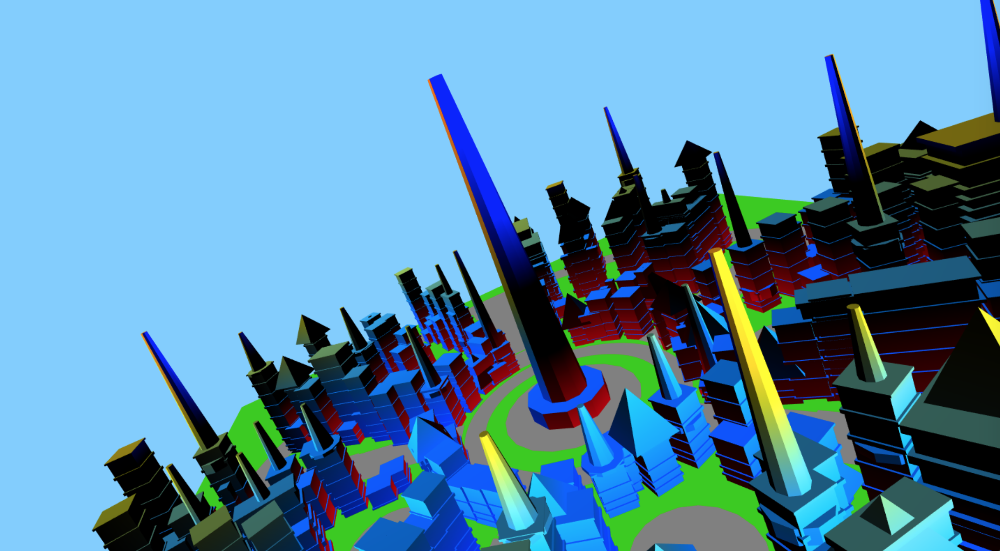
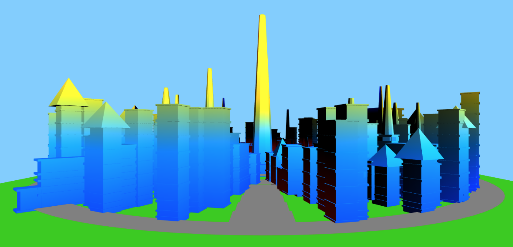

# Project 5: Shape Grammar

Emiliya Al Yafei • PennKey: alyafei

Live Demo:
https://mylesing.github.io/shape-grammar-city/

Welcome to Discount Lumiose™! We didn't have the money to give our residents windows or doors, so it's actually a prison.
We throw our prisoners off of the top of the Traffic Cone of Death if they try to escape.
But at least it's always sunny here!

## Structure & Grammar Rules:
I have a Shape class which stores the building's current floor position, rotation, and scale. Similarly to an L-System, I parse through a string and call functions based on the current character. The city becomes larger with each iteration as the grammar expands.

**Rules:**
- 'B' : draw base
- '+' : add random number of stories
- 'S' : shift in a random direction and draw a connecting building
- 'X / Y' : add roof
- 'F' : scale the building randomly
- '[/]' : push or pop off of the stack to store / get back old position

**Expansion:**
- 'B' -> 'B'
- '+' -> '++'
- 'S'-> 'S++'
- 'X' -> 'Y'
- 'Y' -> 'X'

## Appearance:

The buildings grow larger in all dimensions as we come out of the city center. As they get taller, their peaks turn a different color -- the more yellow the building is, the taller.

We give our prisoners some leasure space by providing them with empty, concrete parks where they can enjoy themselves as they wish!

